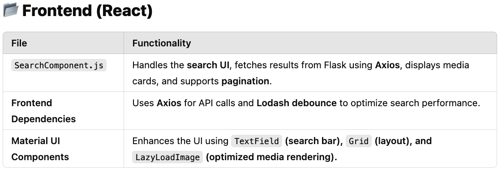
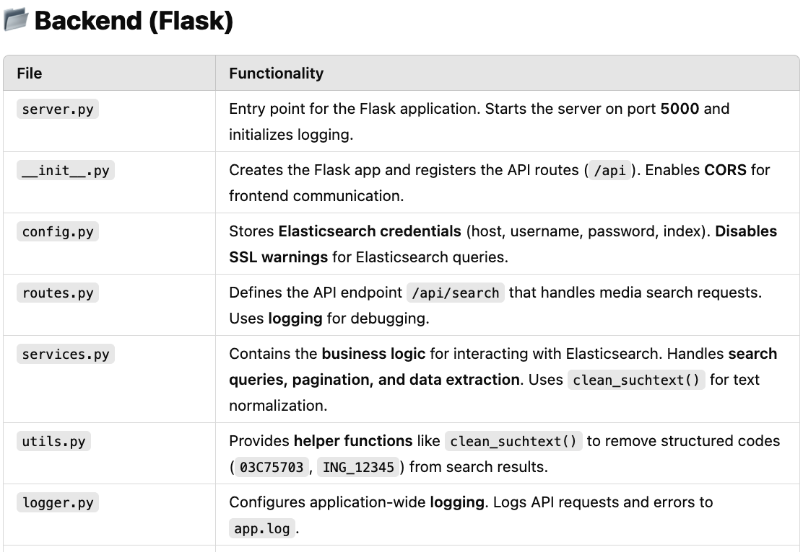

# Media Search System

## 📖 Project Overview
This project is a **full-stack application** that retrieves and displays media records from an **Elasticsearch server**. It includes:
- A **Flask-based backend** to interact with Elasticsearch.
- A **React-based frontend** for a user-friendly media search experience.
- **Data normalization** for enhanced searchability.
- **Pagination and filtering** for efficient data retrieval.
- **Logging and monitoring** for debugging and scalability.

---

## 🚀 Features
- **Keyword-based search** across metadata fields (title, description, photographer).  
- **Cleaned and normalized search results** for better readability.  
- **Pagination support** to handle large datasets efficiently.  
- **Interactive frontend (React + Material UI)** for a seamless user experience.  
- **Error handling & logging** for robustness and maintainability.  

---

## 🏗️ Tech Stack
### **Backend:**  
- Flask (Python)  
- Elasticsearch (Search Engine)  
- Flask-CORS (Cross-Origin Requests)  
- Built-in Python logging for **monitoring and debugging**  

### **Frontend:**  
- React (JavaScript)  
- Material UI (Design Framework)  
- Axios (API calls)  
- Lodash (Performance Optimization)  

---

## 📝 Thought Process & Design Choices

- **Separation of Concerns:** The project maintains a clear separation between the **backend (Flask, Elasticsearch API)** and **frontend (React, Material UI)** to ensure scalability and maintainability.  
- **Efficiency & Performance:** Lodash’s **debounce function** optimizes API requests, preventing unnecessary calls when users type in the search box.  
- **Data Normalization:** The backend **cleans metadata (`suchtext`)** to enhance readability and improve search accuracy.  
- **Error Handling:** Implemented **basic error handling** to manage API failures and prevent frontend crashes.  
- **Scalability & Search Performance:** The system **supports pagination (`from`, `size`)** for handling large datasets efficiently, while **query execution time** is minimized by limiting searches to **relevant fields** only.  
- **Logging & Monitoring:** A **logging system (`app.log`)** tracks search queries, API failures, and system performance to aid debugging and optimizations.  

---

## 📌 Assumptions
- **Image URLs follow a predictable pattern**, allowing us to construct media links dynamically.  
- **Search Priorities:** Users are most likely searching by **keywords** (e.g., `"dog on the beach"`), so **`match_phrase` queries** are prioritized.  
- **Data Format:** The metadata structure is assumed to be **fixed** and does not change dynamically.  

---

## ⚠️ Limitations
While this implementation meets the core requirements, a **production-ready system** would require several enhancements:

1. **Advanced Query Optimization**  
   - The current **Elasticsearch query** does not fully optimize **search relevance** and lacks efficiency for complex searches.  
   - **Solution:** Implement **field boosting**, **fuzzy matching**, and **semantic search models** (e.g., OpenAI CLIP) for better accuracy.  

2. **Ranking & Relevance Improvements**  
   - The default Elasticsearch `_score` ranking does **not prioritize high-quality or newer images**, leading to less relevant results.  
   - **Solution:** Implement **weighted ranking** to prioritize **higher-resolution and more recent images**.  

3. **Scalability & Load Management**  
   - Frequent queries to **Elasticsearch** can increase server load, and synchronous processing limits scalability.  
   - **Solution:**  
     - Implement **Redis caching** for frequently searched queries.  
     - Use **Elasticsearch request caching** to reduce redundant processing.  
     - Support **asynchronous processing** with **Celery or FastAPI** to improve throughput.  

4. **Comprehensive Error Handling & Monitoring**  
   - The system lacks **centralized error monitoring**, making debugging difficult.  
   - **Solution:**  
     - Integrate **Sentry or Elastic APM** for real-time error tracking.  
     - Use **Kibana & Prometheus** for **query performance monitoring & logging**.  

---

## 🚀 Future Enhancements  

### 🖥️ Backend Enhancements
To improve **scalability, search accuracy, and efficient querying**, the following enhancements are planned:  

- **Sorting & Filtering:** Introduce **filters for date, photographer, and relevance**.  
- **Improved Ranking & Search Relevance:** Boost **newer images (`datum`)** and **higher-resolution images (`hoehe * breite`)**.  
- **Automated Data Normalization:**  
  - Convert `suchtext` into a structured **array of keywords**.  
  - Extract **keywords into a separate `tags` field** for better filtering.  
  - Store `hoehe` and `breite` as **integers** instead of strings.  
- **Advanced Querying & Caching:**  
  - Support **pagination (`from`, `size`)** to optimize search efficiency.  
  - Use **Elasticsearch caching** to store frequent search results.  
- **AI-Powered Enhancements:**  
  - Implement **vector-based similarity search** using FAISS.  
  - Introduce **automatic image tagging** via AI models.  
  - Enable **duplicate detection** using **hashing (SHA-256)**.  

### 🖥️ Frontend Enhancements
The frontend will be enhanced to provide a **more interactive and engaging user experience**:  

- **Search Experience Improvements:**  
  - Implement **autocomplete with live search previews**.  
  - Highlight **matched search terms** in results.  
  - Support **fuzzy search suggestions** for typo tolerance.  
- **Advanced Media Browsing:**  
  - Display **image metadata on hover**.  
  - Enable **fullscreen preview modal with zoom support**.  
  - Improve **mobile-friendly navigation** with swipe gestures.  
- **Diverse Image Display & Search Variety:**  
  - Improve search ranking logic to **prioritize diverse images** instead of showing multiple angles of the same subject.  
  - Group similar images together with an **expand option**.  
- **Dynamic Filtering & Sorting:**  
  - Allow users to **filter by photographer, date, or resolution**.  
  - Introduce **range sliders** for image resolution and date selection.  
- **Performance Optimizations:**  
  - Use **lazy loading & infinite scrolling** to improve efficiency.  
  - Optimize images with **WebP format**.  
- **User Personalization & Engagement:**  
  - Enable users to **save favorites & bookmarks**.  
  - Introduce an **upvoting system** for ranking images.  
  - Show a **"Recently Viewed" section** for user convenience.  

